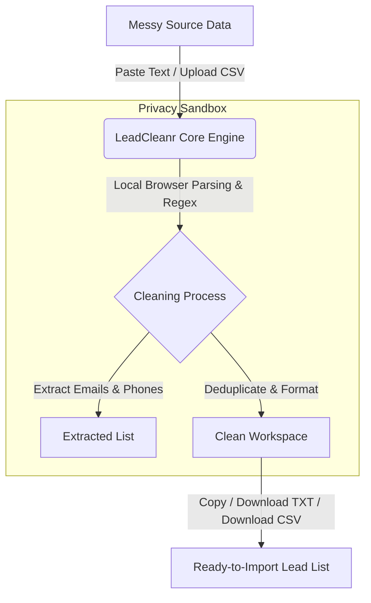

# LeadCleanr — Product Requirements Document (PRD)

## 1. Product Summary & Vision

**Product Name:** LeadCleanr
**Product Type:** Browser-First Online Utility SaaS Tool
**Tagline:** Clean messy lead lists instantly.
**Status:** ✅ Active Release (`v1.1.2`)

### Core Promise
Paste messy text or upload a CSV file to instantly extract, clean, deduplicate, and export lead data. Core processing occurs locally within the browser, keeping raw working data on-device during normal tool use.

### One-Line Positioning
LeadCleanr helps sales development representatives (SDRs), recruiters, marketers, agencies, and virtual assistants format and clean unstructured contact lists in real-time, without leaking sensitive prospect data to third-party servers.



---

## 2. Problem Statement & Value Proposition

### The Problem
Professionals working with outreach databases constantly encounter raw, poorly structured, or duplicated contact information.
- **Data Fragmentation:** Prospect details are often trapped inside email threads, LinkedIn profiles, Slack chats, or poorly formatted CRM exports.
- **Privacy Risks:** Uploading sensitive customer or lead files to server-based formatting tools presents severe data compliance and security risks (GDPR, SOC2).
- **Tool Friction:** Existing tools require registration, credit card entry, or complex spreadsheet formulas (regex/macros) that slow down daily productivity.

### Value Proposition
LeadCleanr addresses these pain points by offering:
1.  **100% Privacy by Default:** All text processing and CSV parsing are executed locally on the user's device using client-side JavaScript APIs. No data is sent to external servers.
2.  **Frictionless UX:** Zero signup or onboarding. The tools are immediately usable from the home page and individual landing pages.
3.  **B2B Polish:** A premium, high-speed, distraction-free environment that builds trust and delivers instant metrics.

---

## 3. Target Audience & Use Cases

### User Personas & Pain Points

| User Persona | Key Use Cases | Primary Pain Points |
| :--- | :--- | :--- |
| **Sales Reps (SDRs/BDRs)** | Format lists from scraping/events before importing into Outreach or Apollo. | CRM exports contain duplicate rows, missing fields, or inconsistent casing. |
| **Recruiters & HR Teams** | Extract candidate emails and phones from ATS copy-pastes or bulk resumes. | Sifting through resumes manually is tedious; copy-pasting is error-prone. |
| **Marketers & ABM Ops** | Extract company domains from massive lead lists to map target account lists. | Stripping email suffixes and removing duplicates manually takes hours in Excel. |
| **Agencies & VAs** | Repeatedly format and sanitize lead databases for multiple client accounts. | Low-budget tools limit exports; privacy concerns prevent using cloud services. |

### Key Workflows
*   **The "Quick Clean" (Text Mode):** Copy a block of text containing mixed text, HTML, and headers, paste it into the UI, click "Extract Emails", and copy the clean, deduplicated list.
*   **Batch Mode:** Toggle batch mode to prepare multiple pasted snippets in one input box, run extraction across the whole set, and replace the current clean result set with one export-ready list.
*   **CSV Sanitizer:** Upload a messy 5MB CRM export, select the target column, remove duplicates, blank rows, and invalid rows, optionally filter business vs. personal emails, then download a clean CSV for immediate import.

---

## 4. MVP Functional Scope

### 4.1 Text Processing Utilities (Client-Side)

| Utility Tool | Core Regex / Logic Specification | Output Actions |
| :--- | :--- | :--- |
| **Extract Emails** | Matching pattern: `\b[a-z0-9._%+-]+@[a-z0-9.-]+\.[a-z]{2,}\b` (Global, Case-Insensitive) | Copy to clipboard, Download TXT, Download CSV. |
| **Extract Phone Numbers** | Matching pattern: `(?:\+?\d[\d().\-\s]{6,}\d)` normalized to strip formatting. | Copy to clipboard, Download TXT, Download CSV. |
| **Extract URLs** | Matching pattern: `\b(?:https?:\/\/|www\.)[^\s<>"'()]+(?:\([^\s<>"']*\)|[^\s<>"'.,;:!?])` (Global, Case-Insensitive) | Copy to clipboard, Download TXT, Download CSV. |
| **Extract Domains** | Extracts domains from emails (splits `@` suffix) or URL hosts. | Copy to clipboard, Download TXT, Download CSV. |
| **Remove Duplicates** | Client-side deduplication using Javascript `Set`. | Real-time cleanup, updates Workspace state. |
| **Clean Email List** | Formats emails: trim whitespaces, convert to lowercase, discard invalid strings. | Cleaned array populated back to results box. |
| **Sort Results** | Alphabetical sorting (A-Z) of extracted strings. | Re-renders sorted output list. |

### 4.2 CSV Processing Suite

*   **Browser-Based Upload:** Supports `.csv` files up to **5 MB** (current free-plan limit).
*   **Interactive Preview:** Reads and displays the first 100–500 rows in a responsive preview table using client-side memory.
*   **Smart Column Auto-Detection:** Automatically scans headers and values to identify and categorize columns (Emails, Phones, URLs, Domains) with confidence scores.
*   **Embedded Contact Extraction:** CSV email and phone extractors can pull valid emails or phone numbers out of messy text inside the selected column's cells.
*   **Targeted Column Cleanup:**
    *   **Deduplication:** Remove duplicate rows based on a selected column (e.g., deduplicate by `Email`).
    *   **Data Formatting:** Trim whitespace, lowercase emails, and normalize phone numbers within the selected column.
    *   **Empty Row Purging:** Remove rows containing empty or invalid values in the primary target column.
    *   **Email-Type Review:** Classify business vs. personal email rows, flag role-based inboxes, and optionally filter those rows before export.
    *   **Review Views:** Preview clean rows, removed rows, and invalid rows before downloading.
*   **CSV Merge Utility:** Combine up to 5 CSV files, preserve unique headers, and deduplicate by exact row or normalized column values.
*   **Blob Export:** Generates the cleaned CSV file on the client side using a browser Blob API for immediate download, while preserving leading `+` in phone columns.

### 4.3 Real-Time Value Metrics
Every tool page and utility must display a dedicated **Stats Box** highlighting:
1.  **Total Found:** Gross count of extracted items before cleaning.
2.  **Duplicates Removed:** Total count of duplicate records purged.
3.  **Invalid Entries Removed:** Number of entries that failed regex/validation tests.
4.  **Filtered Rows Removed:** Number of records excluded by cleanup filters such as business-only or personal-only email mode.
5.  **Final Clean Leads:** Net count of verified, unique records ready for export.

---

## 5. Non-Goals & Future Roadmap

> [!IMPORTANT]
> To ensure a fast MVP launch and validate market demand, the following items are strictly out-of-scope for the initial version.

```
+-------------------------------------------------------------------+
|                        OUT OF SCOPE FOR MVP                       |
+---------------------+-----------------------+---------------------+
|  User Login / Auth  |  Cloud File Storage   |  AI-Based Parsing   |
+---------------------+-----------------------+---------------------+
|  Stripe Payments    |  CRM Integrations     |  Google Sheets Sync |
+---------------------+-----------------------+---------------------+
|  SMTP Verification  |  Shared Workspaces    |  Rust WebAssembly   |
+---------------------+-----------------------+---------------------+
```

### Future Phased Roadmap
*   **Phase 2 (Monetization):** Introduce user accounts, Stripe billing, larger file processing limits (10MB-25MB), saved cleaning workflows, and basic history.
*   **Phase 3 (Business & API):** Launch LeadCleanr API, team collaboration settings, email verification credits (pinging SMTP servers), and direct CRM integrations.
*   **Phase 4 (Performance Upgrade):** Integrate Rust compiled to WebAssembly for highly optimized, multithreaded client-side processing of large files (1M+ rows).

---

## 6. Technical Architecture & Hosting

### Frontend and Processing Stack
*   **Core Framework:** Next.js (App Router) for static rendering, SEO compilation, and responsive page routing.
*   **Language:** TypeScript for typed extraction logic, utility schemas, and parser models.
*   **Styling:** Tailwind CSS for a dark-mode styled, premium, responsive layout.
*   **CSV Engine:** `PapaParse` for fast, streaming CSV parses.
*   **Icons:** `lucide-react`.

### Client-Side Processing Flow
```
[User Input/File] ──> [React Tool State] ──> [TypeScript Parser Engine (regex/cleaners)] 
                                                                │
                                                                ▼
[Instant Local Export] <── [Browser Blob API] <── [Updated Results & Stats State]
```

### Hosting Architecture (Self-Hosted on DigitalOcean)
*   **Server Host:** DigitalOcean Droplet (Ubuntu Linux LTS, recommended 1 vCPU / 2GB RAM for smooth builds).
*   **DNS & Registrar:** Namecheap.
*   **Web Server & Reverse Proxy:** Nginx (manages incoming port 80/443 traffic and forwards requests to the application port).
*   **Process Management:** PM2 (monitors the Next.js production server on port 3000, handles automatic reboots).
*   **Security:** SSL certificate managed and updated via Let's Encrypt / Certbot.

---

## 7. Website Structure & SEO Strategy

The growth model relies on a programmatic SEO strategy. Each utility tool is deployed as a standalone, indexable landing page optimized for high-volume keywords.

### Sitemap & Keyword Mapping

| Route Slug | Primary Targeting Keyword | H1 Page Title |
| :--- | :--- | :--- |
| `/` | LeadCleanr | Clean Messy Lead Lists Instantly |
| `/tools` | Lead cleaning tools | Standalone Lead Cleaning & Formatting Tools |
| `/tools/extract-emails-from-text` | extract emails from text | Extract Emails from Text Online |
| `/tools/extract-phone-numbers-from-text` | extract phone numbers from text | Extract Phone Numbers from Text Online |
| `/tools/extract-urls-from-text` | extract URLs from text | Extract URLs from Text Online |
| `/tools/extract-domains-from-emails` | extract domains from email list | Extract Domains from Email List |
| `/tools/remove-duplicate-emails` | remove duplicate emails | Remove Duplicate Emails Online |
| `/tools/clean-email-list` | clean email list online | Clean Email List Online |
| `/tools/csv-lead-cleaner` | CSV lead cleaner | CSV Lead Cleaner & Deduplicator |
| `/tools/extract-emails-from-csv` | extract emails from CSV | Extract Emails from CSV Online |
| `/pricing` | LeadCleanr Pricing | Clean Leads Free — Simple Pricing |
| `/privacy` | Privacy Policy | Privacy Policy & Browser Processing Details |
| `/terms` | Terms of Service | Terms of Service & Acceptable Use |
| `/contact` | Contact LeadCleanr | Contact Us / Feature Requests |

### Page Layout Requirements
To maximize conversion and minimize bounce rate, the actual tool component must be positioned **above the fold** on all utility routes.
1.  **Header/Navbar:** Logo, Tools dropdown, Pricing, Privacy/Security badge.
2.  **Tool Work Area:** Split-screen or card layout containing input textareas/CSV drag-and-drop on the left, and results with download/copy options on the right.
3.  **Metrics Box:** Inline statistics rendering dynamically.
4.  **Instructions & FAQ:** Lower section containing detailed "How to use" lists and targeted SEO FAQs to satisfy search engine crawlers.

---

## 8. Privacy & Acceptable Use Policies

### Browser Security Messaging
Due to the sensitivity of contact lists, LeadCleanr must emphasize its privacy guarantees. The following copy must be present on all upload inputs and tool templates:
> **Privacy Guarantee:** Processing occurs 100% locally in your browser. We never send your pasted text or uploaded files to any server.

### Acceptable Use Policy
To protect the brand and domain authority:
> **Acceptable Use:** LeadCleanr is for cleaning data you own or have permission to process. Do not use it for spam, scraping abuse, or sending unsolicited messages.

---

## 9. Success Metrics & Acceptance Criteria

### Success Metrics
*   **Deployment Success:** 8 functional SEO tool pages, Homepage, Pricing, Privacy, Terms, and Contact pages live.
*   **Performance:** Client-side CSV parser processing a 5 MB file and showing previews/stats quickly enough for an interactive browser workflow on a modern laptop.
*   **Usability:** Zero latency shifts or hydration errors when local storage recovers workspaces across sessions.

### Core Acceptance Criteria

#### Text Extraction Tools
- User can input unstructured text, run the extractor, and view sanitized strings.
- Duplicates are successfully filtered out when the "Remove Duplicates" option is checked.
- Sorting actions (A-Z) re-order results in real-time.
- One-click copying to clipboard works across all modern browsers.
- TXT and CSV export actions download valid files containing the results.

#### CSV Cleaning Tool
- Handles file upload and parses correctly.
- Previews the first 100–500 rows in a grid layout.
- Correctly identifies primary data columns (Emails, Phones, URLs).
- Deduplicates rows according to the chosen column key, updating the preview.
- Shows removed and invalid row previews before export.
- Reports rows removed by email filtering when business-only or personal-only mode is enabled.
- Allows immediate download of the sanitized CSV without uploading any data to a backend.
